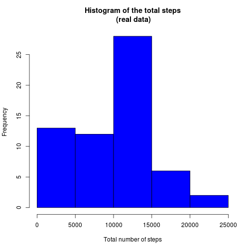
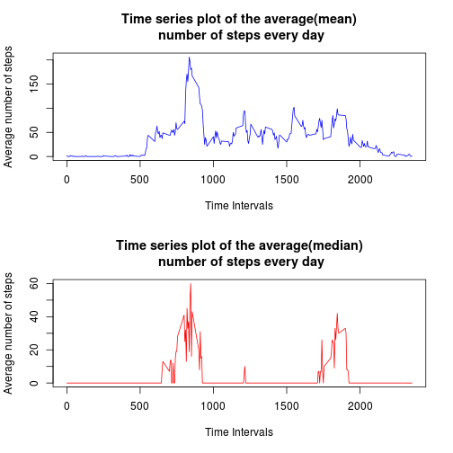
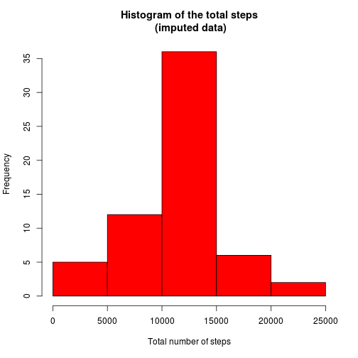
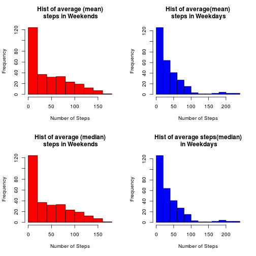

# Loading and preprocessing the data
It is now possible to collect a large amount of data about personal movement using   
activity monitoring devices such as a Fitbit, Nike Fuelband, or Jawbone Up.   
These type of devices are part of the “quantified self” movement – a group of   
enthusiasts who take measurements about themselves regularly to improve their   
health, to find patterns in their behavior, or because they are tech geeks.   
But these data remain under-utilized both because the raw data are hard to obtain   
and there is a lack of statistical methods and software for processing and interpreting the data.  
  
This assignment makes use of data from a personal activity monitoring device.  
This device collects data at 5 minute intervals through out the day.   
The data consists of two months of data from an anonymous individual collected   
during the months of October and November, 2012 and include the number of steps taken in 5 minute intervals each day.  

* Read in the data

```r
data = read.csv('activity.csv')
```

_Note that you need to position the markdown and the data in the same directory._  
* Check what are the data type for each column 

```r
str(data)
```

```
## 'data.frame':	17568 obs. of  3 variables:
##  $ steps   : int  NA NA NA NA NA NA NA NA NA NA ...
##  $ date    : Factor w/ 61 levels "2012-10-01","2012-10-02",..: 1 1 1 1 1 1 1 1 1 1 ...
##  $ interval: int  0 5 10 15 20 25 30 35 40 45 ...
```
Everything looks ok with how thw data is read in. We note that there are 61 days.

# Analysis 
The purpose of this analysis is to use no additinal packages, so that it fits to the ideal of reproscibility. 

## What is mean total number of steps taken per day?
For this part of the assignment, you can ignore the missing values in the dataset. 
First, let's create histogram of the total number of steps each day.

```r
days = unique(data$date)
#empty vector for the total steps
tot_steps = c()
#loop through every day
for(i in 1:length(days)){
  tot_today = sum(data[data$date==days[i],]$steps,na.rm = TRUE)
  tot_steps = c(tot_steps,tot_today)
}
#create data frame to fill the date and the tot_steps
tot_table = as.data.frame(matrix(NA,nrow = 61,ncol =2))
colnames(tot_table)= c('days','tot_steps')
tot_table$days = days
tot_table$days = as.Date(as.character(tot_table$days))
tot_table$tot_steps = tot_steps
#plot it 
hist(tot_table$tot_steps, col = 'blue',
     main = 'Histogram of the total steps\n (real data)',
     xlab = 'Total number of steps')
```


  
Then, let's calculate what is the mean and the median. 

```r
mean_total_steps = mean(data$steps, na.rm = TRUE)
median_total_steps = median(data$steps, na.rm = TRUE)
print(paste('Mean of total steps is',mean_total_steps))
```

```
## [1] "Mean of total steps is 37.3825995807128"
```

```r
print(paste("median of total steps is",median_total_steps))
```

```
## [1] "median of total steps is 0"
```

## What is the average daily activity pattern?

### Make a time series plot (i.e. type = "l") of the 5-minute interval (x-axis) and the average number of steps taken, averaged across all days (y-axis)

Create the data cut

```r
mm_table = as.data.frame(matrix(NA,nrow = 1, ncol = 2))
intervals = unique(data$interval)
#cretae the table
for(i in 1:length(intervals)){
  mean_current = round(mean(data[data$interval == intervals[i],]$steps,na.rm=TRUE),0)
  median_current = median(data[data$interval == intervals[i],]$steps,na.rm=TRUE)
  mm_table = rbind(mm_table,c(mean_current,median_current))
}

#remove the first artificial row  
mm_table = mm_table[-1,]
#add the days 
#ys_char = as.character(days)
mm_table = cbind(intervals,mm_table)
colnames(mm_table) = c('intervals','mean','median')
head(mm_table)
```

```
##   intervals mean median
## 2         0    2      0
## 3         5    0      0
## 4        10    0      0
## 5        15    0      0
## 6        20    0      0
## 7        25    2      0
```
Plot two graphs to indicate the difference in terms of median and mean. 

```r
par(mfrow=c(2,1))
plot(mm_table$intervals,mm_table$mean,type = 'l', col = 'blue',
     main = 'Time series plot of the average(mean)\n number of steps every day',
     ylab = 'Average number of steps',
     xlab = 'Time Intervals')
plot(mm_table$intervals,mm_table$median,type = 'l', col = 'red',
     main = 'Time series plot of the average(median)\n number of steps every day',
     ylab = 'Average number of steps',
     xlab = 'Time Intervals')
```


  
### Which 5-minute interval, on average across all the days in the dataset, contains the maximum number of steps?

```r
mean_max_int = mm_table[mm_table$mean == max(mm_table$mean,na.rm = TRUE),]$intervals
print(paste('The interval', mean_max_int,'contains the maximum number of steps based on the mean'))
```

```
## [1] "The interval 835 contains the maximum number of steps based on the mean"
```

```r
median_max_int = mm_table[mm_table$median == max(mm_table$median,na.rm = TRUE),]$intervals
print(paste('The interval', median_max_int,'contains the maximum number of steps based on the median'))
```

```
## [1] "The interval 845 contains the maximum number of steps based on the median"
```


## Imputing missing values

### Code to describe and show a strategy for imputing missing data

```r
data_imputed = data
#where do we find NA values
summary(data)
```

```
##      steps                date          interval     
##  Min.   :  0.00   2012-10-01:  288   Min.   :   0.0  
##  1st Qu.:  0.00   2012-10-02:  288   1st Qu.: 588.8  
##  Median :  0.00   2012-10-03:  288   Median :1177.5  
##  Mean   : 37.38   2012-10-04:  288   Mean   :1177.5  
##  3rd Qu.: 12.00   2012-10-05:  288   3rd Qu.:1766.2  
##  Max.   :806.00   2012-10-06:  288   Max.   :2355.0  
##  NA's   :2304     (Other)   :15840
```

```r
num_na = sum(is.na(data$steps))
print(num_na)
```

```
## [1] 2304
```

Now let's impute these values.  
We impute with the **mean of the day** itself. If there are no values avaulable for the particular day,  
than we take the **mean for all days** and all intervals. 

```r
mean_all_days = mean(data_imputed$steps,na.rm = TRUE)

for(i in 1:length(days)){
  temp_data=data_imputed[data_imputed$date==days[i],]$steps
  #impute the whole days
  if(sum(is.na(temp_data))==length(temp_data)){
    data_imputed[data_imputed$date==days[i],]$steps = mean_all_days
  }else{
    #take the mean of the day itself
    mean_day = mean(temp_data,na.rm = TRUE)
    temp_data = ifelse(is.na(temp_data),mean_day,temp_data)
    data_imputed[data_imputed$date==days[i],]$steps = temp_data
        
  }
}

summary(data_imputed)
```

```
##      steps                date          interval     
##  Min.   :  0.00   2012-10-01:  288   Min.   :   0.0  
##  1st Qu.:  0.00   2012-10-02:  288   1st Qu.: 588.8  
##  Median :  0.00   2012-10-03:  288   Median :1177.5  
##  Mean   : 37.38   2012-10-04:  288   Mean   :1177.5  
##  3rd Qu.: 37.38   2012-10-05:  288   3rd Qu.:1766.2  
##  Max.   :806.00   2012-10-06:  288   Max.   :2355.0  
##                   (Other)   :15840
```
### Create histogram for the total number of steps taken each day


```r
days = unique(data_imputed$date)
#empty vector for the total steps
tot_steps = c()
#loop through every day
for(i in 1:length(days)){
  tot_today = sum(data_imputed[data_imputed$date==days[i],]$steps,na.rm = TRUE)
  tot_steps = c(tot_steps,tot_today)
}
#create data_imputed frame to fill the date and the tot_steps
tot_table = as.data.frame(matrix(NA,nrow = 61,ncol =2))
colnames(tot_table)= c('days','tot_steps')
tot_table$days = days
tot_table$days = as.Date(as.character(tot_table$days))
tot_table$tot_steps = tot_steps
#plot it 
hist(tot_table$tot_steps, col = 'red',
     main = 'Histogram of the total steps\n (imputed data)',
     xlab = 'Total number of steps')
```



Then let's calculate the mean of the imputed data. 

```r
mean_total_steps = mean(data$steps, na.rm = TRUE)
median_total_steps = median(data$steps, na.rm = TRUE)
print(paste('Mean of total steps is',mean_total_steps))
```

```
## [1] "Mean of total steps is 37.3825995807128"
```

```r
print(paste("median of total steps is",median_total_steps))
```

```
## [1] "median of total steps is 0"
```
**Conclusion:** there is no significant impact in terms of the mean, median or the histogram distribution.

## Are there differences in activity patterns between weekdays and weekends?
###Panel plot comparing the average number of steps taken per 5-minute interval across weekdays and weekends
First create mean for median for the weekends and weekdays.

```r
#differentiate weekdays and weekends
data$weekday = weekdays(as.Date(data$date))
data$weekday = ifelse(data$weekday %in% c('Saturday', 'Sunday'),'weekend','weekday')

#WEEKEND
mm_table_end = as.data.frame(matrix(NA,nrow = 1, ncol = 2))
#intervals = unique(data$interval)
#cretae the table
for(i in 1:length(intervals)){
  mean_current = round(mean(data[data$interval == intervals[i] & data$weekday == 'weekend',]$steps,na.rm=TRUE),0)
  median_current = median(data[data$interval == intervals[i] & data$weekday == 'weekend',]$steps,na.rm=TRUE)
  mm_table_end = rbind(mm_table_end,c(mean_current,median_current))
}

#remove the first artificial row  
mm_table_end = mm_table_end[-1,]
#add the intervals
mm_table_end = cbind(intervals,mm_table_end)
colnames(mm_table_end) = c('intervals','mean','median')

#WEEKDAY
mm_table_day = as.data.frame(matrix(NA,nrow = 1, ncol = 2))
#intervals = unique(data$interval)
#cretae the table
for(i in 1:length(intervals)){
  mean_current = round(mean(data[data$interval == intervals[i] & data$weekday == 'weekday',]$steps,na.rm=TRUE),0)
  median_current = median(data[data$interval == intervals[i] & data$weekday == 'weekday',]$steps,na.rm=TRUE)
  mm_table_day = rbind(mm_table_day,c(mean_current,median_current))
}

#remove the first artificial row  
mm_table_day = mm_table_day[-1,]
#add intervals
mm_table_day = cbind(intervals,mm_table_day)
colnames(mm_table_day) = c('intervals','mean','median')
```

Then let's plot histogram in a panel.


```r
#plot two histograms 
par(mfrow=c(2,2))
#weekend histogram mean
hist(mm_table_end$mean,col='red',
     main='Hist of average (mean)\n steps in Weekends',
     xlab = 'Number of Steps')
#weekday histogram mean
hist(mm_table_day$mean,col='blue',
     main='Hist of average(mean)\n steps in Weekdays',
     xlab = 'Number of Steps')
#weekend histogram median
hist(mm_table_end$mean,col='red',
     main='Hist of average (median)\n steps in Weekends',
     xlab = 'Number of Steps')
#weekday histogram median
hist(mm_table_day$mean,col='blue',
     main='Hist of average steps(median)\n in Weekdays',
     xlab = 'Number of Steps')
```


  
**Conclusion:**  We see considerable difference between weekdays and weekends. 
